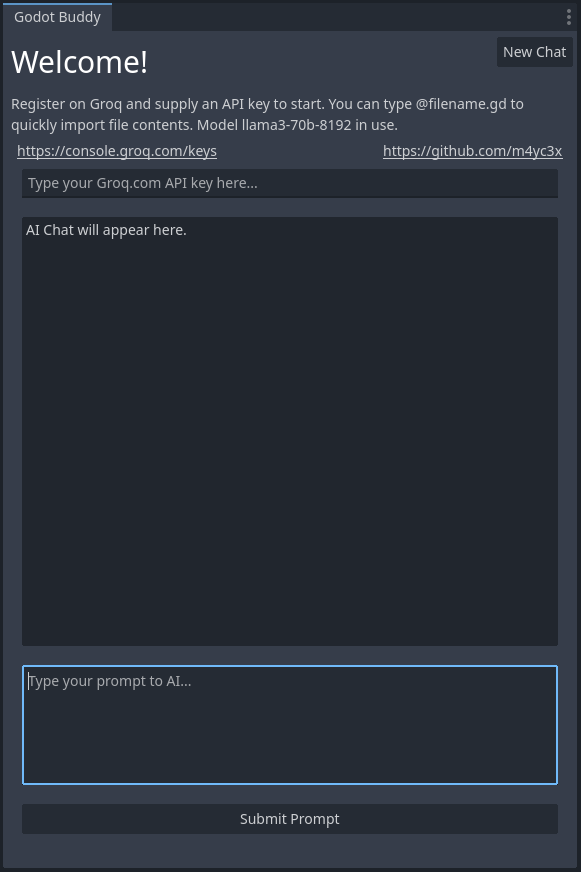
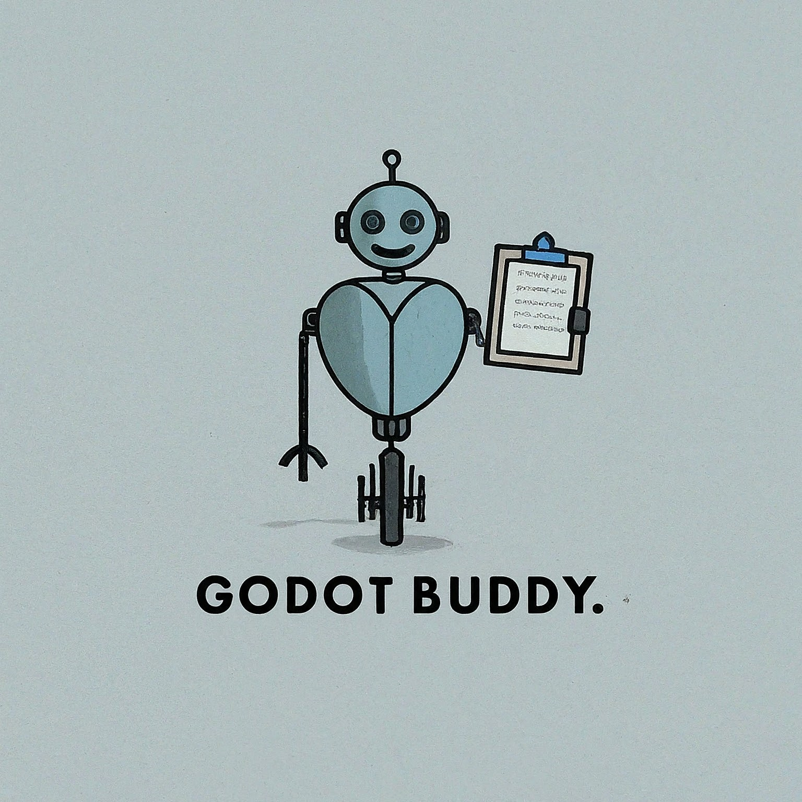

# GodotBuddy

Welcome to **GodotBuddy**! GodotBuddy is an advanced plugin for the Godot 4 Engine designed to assist you in coding and game design. It leverages AI to provide intelligent code suggestions, documentation, and more, all within the Godot Editor.

## Features

- **AI-Powered Code Assistance**: Get real-time code suggestions and improvements.
- **File Content Replacement**: Automatically replace file references with their contents.
- **Chat History**: Maintain a history of your interactions with the AI.
- **API Key Management**: Securely store and manage your API key.

## Installation

1. **Download the Plugin**: Clone or download the GodotBuddy repository.
2. **Add to Project**: Copy the `addons/godotbuddy` folder into your Godot project's `addons` directory.
3. **Enable the Plugin**: Open your project in Godot, go to `Project > Project Settings > Plugins`, and enable `GodotBuddy`.

## Usage

1. **Open the GodotBuddy Dock**: Once enabled, you will see the GodotBuddy dock on the right side of the editor.
2. **Enter Your API Key**: Input your API key in the provided field. The key will be saved.
    a. Acquire free or paid keys from [Groq.com Keys Dashboard](https://console.groq.com/keys)
3. **Interact with the AI**: Type your queries or code in the text editor and press the submit button. The AI will respond with suggestions or code snippets. 

You can use `@filename.gd` to reference a file in the editor, regardless of subdirectory. (finds first match, use a full path if you have multiple files with the same name)

## Contributing

We welcome contributions! If you have suggestions, bug reports, or want to contribute code, please open an issue or submit a pull request on our [GitHub repository](https://github.com/yourusername/godotbuddy).

## License

This project is licensed under the MIT License. See the [LICENSE](LICENSE) file for details.

## Acknowledgements

- **Godot Engine**: For providing an amazing open-source game engine.
- **OpenAI**: For the powerful AI models that make GodotBuddy possible.

## Contact

For any questions or support, please open an issue on this github repo.

---

Happy coding with GodotBuddy!
